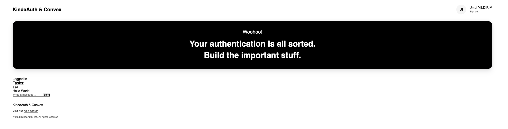

# Convex Database Adapter for Kinde Auth

This library enables authentication built entirely on top of Convex without any third-party platform. It uses [Kinde](https://kinde.com) for the authentication logic.



## Installation

Note: This package is not published by Convex or Kinde. We will update it as soon as we publish it.

```bash
npm install @umuthopeyildirim/convex-kinde-auth
```

```bash
yarn add @umuthopeyildirim/convex-kinde-auth
```

```bash
pnpm add @umuthopeyildirim/convex-kinde-auth
```

## Usage

### Create .env file

Get your Kinde credentials from the kinde application (make sure you created a React single page app) and paste it to env file.

```env
VITE_KINDE_CLIENT_ID=your_kinde_client_id
VITE_KINDE_DOMAIN=https://your_subdomain.kinde.com
VITE_KINDE_REDIRECT_URL=http://localhost:3000
VITE_KINDE_LOGOUT_URL=http://localhost:3000
VITE_KINDE_AUDIENCE="convex"

# Deployment used by `pnpm convex dev`
CONVEX_DEPLOYMENT=
VITE_CONVEX_URL=
```

```javascript
import React from "react";
import ReactDOM from "react-dom/client";
import { KindeProvider } from "@kinde-oss/kinde-auth-react";
import { ConvexReactClient } from "convex/react";
import { ConvexProviderWithKinde } from "@umuthopeyildirim/convex-kinde-auth";
import App from "./App.jsx";
import "./index.css";

const convex = new ConvexReactClient(import.meta.env.VITE_CONVEX_URL);
console.log(import.meta.env.VITE_KINDE_LOGOUT_URI);
ReactDOM.createRoot(document.getElementById("root")).render(
  <React.StrictMode>
    <KindeProvider
      clientId={import.meta.env.VITE_KINDE_CLIENT_ID}
      domain={import.meta.env.VITE_KINDE_DOMAIN}
      logoutUri={import.meta.env.VITE_KINDE_LOGOUT_URI}
      redirectUri={import.meta.env.VITE_KINDE_REDIRECT_URI}
      audience="convex"
      isDangerouslyUseLocalStorage={true}
    >
      <ConvexProviderWithKinde client={convex}>
        <App />
      </ConvexProviderWithKinde>
    </KindeProvider>
  </React.StrictMode>
);
```

# What is Kinde?

[Kinde](https://kinde.com) is a comprehensive authentication solution designed to simplify and secure user authentication processes for web applications. It offers a range of features and functionalities to streamline authentication workflows, enhance security, and provide a seamless user experience.

With Kinde, developers can easily integrate authentication into their applications, allowing users to securely log in, register, and manage their accounts. Kinde supports various authentication methods, including email/password, social login (e.g., Google, Facebook), and more, catering to diverse user preferences and requirements.

One of the key features of Kinde is its flexibility and customization options. Developers can tailor the authentication process to fit their specific application requirements, adjusting settings such as password policies, account verification methods, and multi-factor authentication configurations.

Kinde prioritizes security and compliance, implementing industry-standard security protocols and best practices to protect user data and prevent unauthorized access. It offers features such as secure password hashing, JWT (JSON Web Token) authentication, and session management to safeguard user accounts and sensitive information.

If you’re a founder with a new idea and want to get up and going quickly, this is a great place to start. Conversely, if you already have a project underway, consider using one of the [Kinde SDKs](https://github.com/kinde-oss).

Consider using one of our [Kinde starter kits](https://github.com/kinde-starter-kits) if you’re starting from scratch.

# What is Convex?

[Convex](https://convex.dev) is a hosted backend platform with a
built-in database that lets you write your
[database schema](https://docs.convex.dev/database/schemas) and
[server functions](https://docs.convex.dev/functions) in
[TypeScript](https://docs.convex.dev/typescript). Server-side database
[queries](https://docs.convex.dev/functions/query-functions) automatically
[cache](https://docs.convex.dev/functions/query-functions#caching--reactivity) and
[subscribe](https://docs.convex.dev/client/react#reactivity) to data, powering a
[realtime `useQuery` hook](https://docs.convex.dev/client/react#fetching-data) in our
[React client](https://docs.convex.dev/client/react). There are also
[Python](https://docs.convex.dev/client/python),
[Rust](https://docs.convex.dev/client/rust),
[ReactNative](https://docs.convex.dev/client/react-native), and
[Node](https://docs.convex.dev/client/javascript) clients, as well as a straightforward
[HTTP API](https://github.com/get-convex/convex-js/blob/main/src/browser/http_client.ts#L40).

The database support
[NoSQL-style documents](https://docs.convex.dev/database/document-storage) with
[relationships](https://docs.convex.dev/database/document-ids) and
[custom indexes](https://docs.convex.dev/database/indexes/)
(including on fields in nested objects).

The
[`query`](https://docs.convex.dev/functions/query-functions) and
[`mutation`](https://docs.convex.dev/functions/mutation-functions) server functions have transactional,
low latency access to the database and leverage our
[`v8` runtime](https://docs.convex.dev/functions/runtimes) with
[determinism guardrails](https://docs.convex.dev/functions/runtimes#using-randomness-and-time-in-queries-and-mutations)
to provide the strongest ACID guarantees on the market:
immediate consistency,
serializable isolation, and
automatic conflict resolution via
[optimistic multi-version concurrency control](https://docs.convex.dev/database/advanced/occ) (OCC / MVCC).

The [`action` server functions](https://docs.convex.dev/functions/actions) have
access to external APIs and enable other side-effects and non-determinism in
either our
[optimized `v8` runtime](https://docs.convex.dev/functions/runtimes) or a more
[flexible `node` runtime](https://docs.convex.dev/functions/runtimes#nodejs-runtime).

Functions can run in the background via
[scheduling](https://docs.convex.dev/scheduling/scheduled-functions) and
[cron jobs](https://docs.convex.dev/scheduling/cron-jobs).

Development is cloud-first, with
[hot reloads for server function](https://docs.convex.dev/cli#run-the-convex-dev-server) editing via the
[CLI](https://docs.convex.dev/cli). There is a
[dashbord UI](https://docs.convex.dev/dashboard) to
[browse and edit data](https://docs.convex.dev/dashboard/deployments/data),
[edit environment variables](https://docs.convex.dev/production/environment-variables),
[view logs](https://docs.convex.dev/dashboard/deployments/logs),
[run server functions](https://docs.convex.dev/dashboard/deployments/functions), and more.

There are built-in features for
[reactive pagination](https://docs.convex.dev/database/pagination),
[file storage](https://docs.convex.dev/file-storage),
[reactive search](https://docs.convex.dev/text-search),
[https endpoints](https://docs.convex.dev/functions/http-actions) (for webhooks),
[streaming import/export](https://docs.convex.dev/database/import-export/), and
[runtime data validation](https://docs.convex.dev/database/schemas#validators) for
[function arguments](https://docs.convex.dev/functions/args-validation) and
[database data](https://docs.convex.dev/database/schemas#schema-validation).

Everything scales automatically, and it’s [free to start](https://www.convex.dev/plans).
